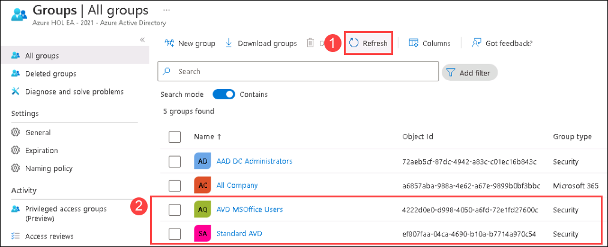
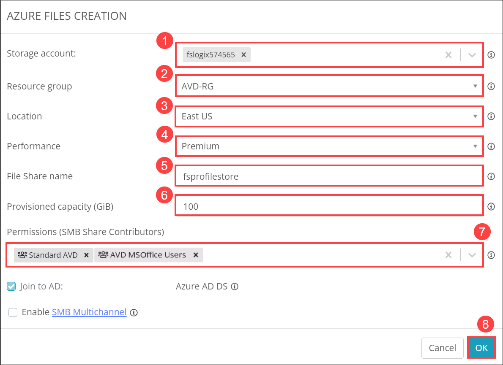

# Lab 1: Configure NMM and Create NMM Account

## Overview

Azure AD Security Groups are Security Principals, which means they can be used to secure objects in Azure AD. They can be created natively in Azure AD, or synced from Windows AD with Azure AD Connect. NMM Partner API allows MSPs to automate various actions in NMM via API that they can do via the NMM portal. For example, MSPs can create & manage host pools, hosts, and desktop images all via the API. In this lab, you'll be creating groups in Azure AD, accessing the NMM portal using the web app, and creating an NMM Account.

## Exercise 1: Create Groups in Azure AD.

In this exercise, you'll be creating two security groups from the Azure Active Directory by logging into the Azure Portal.

1. Navigate to the Azure portal, then search for **Azure Active Directory** ***(1)*** in the search bar and select **Azure Active Directory** ***(2)*** from the suggestions.

   
    
2. You will be directed towards the Azure Active Directory Overview window.

   
    
3. Click on the **Groups** tab under the **Manage** blade.

   
    
4. Click on the **New group**.

   
    
5. Select the Group type as **Security** *****(1)*****, Group **Standard AVD** *****(2)***** and click on **Create** *****(3)*****. Your group will be created successfully.

   

6. Again click on **New group**.

   

7. Select the Group type as **Security** *****(1)*****, Group **AVD MSOffice Users** *****(2)***** and click on **Create** *****(3)*****. Your group will be created successfully.

   
    
8. Now in the **Groups | All groups**, Click on **Refresh** *****(1)*****. You will be able to see the two newly created groups named **Standard AVD** and **AVD MSOffice Users** *****(2)*****.

   

## Exercise 2: Getting started with NMM

In this exercise, you'll be accessing the NMM portal using the web app, registering for **Nerdio Manager for MSP** with the help of Powershell commands, and creating your own **NMM Account** from the **NMM Portal**.

1. On the Azure portal search for **Resource groups** in the search bar *****(1)***** and select **Resource groups** *****(2)***** from the suggestions.

   
   
1. Select **NMM-RESOURCES-RG** from the list of resource groups which is a dynamic RG created during the creation of the NMM resource. It contains all the required resources.

   
   
1. Select the App service from the name, **web-admin-portal-[unique ID]** from the list of resources.

   
   
1. From the App service page, click on the **URL** to access the Nerdio portal.

   
   
1. From the Nerdio portal, Click on the **Copy** *****(1)***** button to copy the PowerShell command and paste it into the Notepad as you'll be using later in the lab, and then click on the **Launch Azure Cloud Shell** *****(2)*****.
 
   
   
1. Now you'll be redirected to **Welcome to Azure Cloud Shell** window, Here click on **PowerShell**.

   
   
1. Click on **Show advanced settings** to configure a new storage account.
    
   
   
1. Use existing **JumpVM-RG** for the resource group. Create new storage account as **storage<inject key="DeploymentID" enableCopy="false" />** and File share as **blob**, then click on **Create storage** button.

   
   
1. Once the Cloud Shell is launched, Paste the PowerShell **command** which we copied earlier in *step 5* and press **Enter**.

   

   >**NOTE**: The execution of the command will take 5 to 10 minutes to complete, Wait for the command to complete before proceeding with the lab.

1. Navigate back to the previous **browser tab** ***(1)*** and **refresh** ***(2)*** the web page. Click on **Accept** ***(3)*** to provide the neccessary permissions.

   
   
1. Provide the following details on the registration page, and click on **Register** *****(4)*****.

   - Company: **Select the default subscription** ***(1)***
   - Name: **odl_user_<inject key="DeploymentID" enableCopy="false" />** ***(2)***
   - Email: **<inject key="AzureAdUserEmail" />** ***(3)***
   
   
   
1. Once registered, You'll land up in **NMM portal**. Click on **Add account** to create a new NMM account.

   
   
1. Now on the ADD ACCOUNT page, provide the following details.

   **A. STEP 1: LINK TO CUSTOMER'S AZURE AD TENANT**
   
   - Grant access to Azure AD Tenant: Click on **Connect** ***(1)***, Follow the steps to Login into your Azure account.

   
     
   Click on **Accept** to provide the necessary permission.
     
   
     
   - Account name: Leave it to **Default value** ***(2)***
   - Desktop deployment model: Select **Azure Virtual Desktop** ***(3)*** 
   - Select subscription: Select the **default subscription** from the drop down ***(4)***
   - Indicate your Active Directory setup: Select **Use existing Azure AD DS** ***(5)*** from the drop down
   
   Click on **Save & next** ***(6)*** and wait for the configuration to complete.
   
   
   
   **B. STEP 2: NETWORKING**
   
   - Select Azure region: **<inject key="Resource group Location" />** ***(1)***
   - Select or create Resource Group: **AVD-RG** ***(2)***
   - Select network: **aadds-subnet(10.0.0.0/24)** ***(3)***
   
   Select **Save & next** ***(4)*** and wait for the configuration to complete.
   
   
   
   **C. STEP 3: ACTIVE DIRECTORY - EXISTING AZURE AD DS**
   
   - Domain name: **<inject key="Tenant FQDN" />** ***(1)***
   - Domain admin user: **<inject key="AzureAdUserEmail" />** ***(2)***
   - Domain admin password: **<inject key="AzureAdUserPassword" />** ***(3)***

   Click on **Save & next** ***(4)*** and wait for the configuration to complete.
   
   
   
   **D. STEP 4: FSLOGIX STORAGE**
   
   Select **Create new Azure Files share** ***(1)*** and click on **Add** ***(2)***.
   
   
   
   provide the following details to create a new storage account for FSLogix, and click on **OK** ***(8)***

   
   - Storage account: **fslogix<inject key="DeploymentID" enableCopy="false" />** ***(1)***
   - Resource group: Select **AVD-RG** ***(2)*** from the drop down
   - Location: **<inject key="Resource group Location" />** ***(3)***
   - Performance: **Premium** ***(4)***
   - File Share name: **fsprofilestore** ***(5)***
   - Provisioned capacity(GiB): **100** ***(6)***
   - Permissions (SMB Share Contributor): Type *Standard AVD* and then select **Standard AVD**, type *AVD MSOffice Users* and then select **AVD MSOffice Users** ***(7)*** from the suggestion.

   
   
   Click on **Save & done** and wait for the configuration to complete.
   
   
  
1. Once the account is added. You'll be able to see your NMM account in the **ACCOUNTS** blade.

   

1. Click on the **Next** button present in the bottom-right corner of this lab guide.

